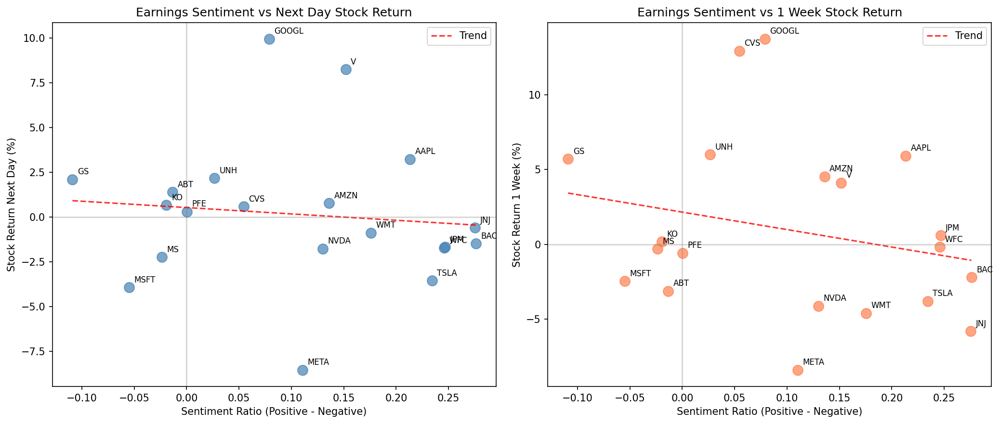
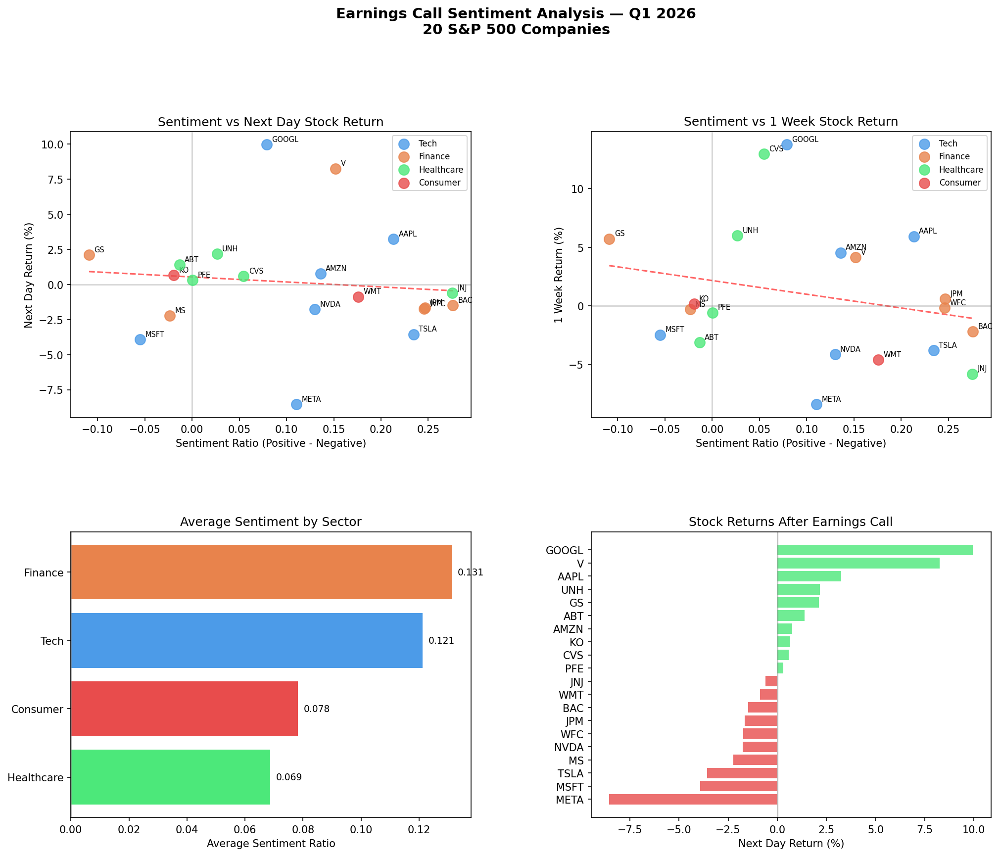

# Earnings Sentiment Engine

This project analyzes whether the language used in earnings-related SEC filings can help explain short-term stock price movement. It combines SEC EDGAR filing extraction, financial-domain NLP with FinBERT, Yahoo Finance price data, and correlation analysis across 20 large public companies.

The core question:

> Does earnings-call or earnings-release sentiment predict how a stock moves after the filing?

The answer in this proof of concept was counterintuitive: higher positive sentiment did not translate into stronger next-day returns. In this sample, the sentiment ratio had a weak negative correlation with both 1-day and 1-week stock performance.

## Project Highlights

- Scraped recent earnings-related 8-K filings from the SEC EDGAR API
- Extracted and cleaned filing text for 20 S&P 500 companies
- Ran sentiment analysis using `ProsusAI/finbert`, a BERT model trained for financial text
- Pulled stock prices around filing dates using `yfinance`
- Compared sentiment ratios against 1-day and 1-week post-filing returns
- Produced final visualizations summarizing the relationship between sentiment and returns

## Key Results

| Metric | Correlation with Sentiment Ratio |
| --- | ---: |
| 1-day stock return | -0.105 |
| 1-week stock return | -0.238 |

The weak negative relationship suggests that optimistic language alone is not a reliable short-term trading signal. Management teams often frame earnings updates positively, so investors appear to respond more strongly to fundamentals, guidance, earnings surprises, and forward-looking expectations than to the tone of the filing itself.

Notable examples from the sample:

- **GOOGL** had the strongest 1-day and 1-week performance, rising **9.96%** after one trading day and **13.75%** after one week.
- **META** had the weakest performance, falling **8.55%** after one trading day and **8.41%** after one week.
- **Goldman Sachs** had one of the most negative sentiment ratios in the dataset but still gained **2.11%** the next day, reinforcing that market reaction depends on more than wording.

## Visual Results

### Sentiment vs. Returns



### Final Results Summary



## Dataset

The analysis covers 20 companies across technology, finance, healthcare, and consumer sectors:

| Ticker | Company |
| --- | --- |
| AAPL | Apple Inc |
| MSFT | Microsoft Corporation |
| JPM | JPMorgan Chase |
| JNJ | Johnson & Johnson |
| AMZN | Amazon |
| GOOGL | Alphabet |
| BAC | Bank of America |
| PFE | Pfizer |
| V | Visa |
| UNH | UnitedHealth Group |
| GS | Goldman Sachs |
| MS | Morgan Stanley |
| WFC | Wells Fargo |
| META | Meta Platforms |
| NVDA | Nvidia |
| TSLA | Tesla |
| CVS | CVS Health |
| ABT | Abbott Laboratories |
| WMT | Walmart |
| KO | Coca Cola |

## Repository Structure

```text
.
+-- 01_data_pipeline.ipynb.ipynb
+-- 02_sentiment_analysis.ipynb.ipynb
+-- 03_correlation_analysis.ipynb.ipynb
+-- 04_results_summary.ipynb.ipynb
+-- Analysis Project Document.ipynb
+-- charts/
|   +-- final_results.png
|   +-- sentiment_vs_returns.png
+-- data/
|   +-- filings_metadata.csv
|   +-- price_changes.csv
|   +-- sentiment_results.csv
|   +-- texts/
|       +-- *_earnings.txt
+-- README.md
```

## Workflow

### 1. Data Pipeline

Notebook: `01_data_pipeline.ipynb.ipynb`

- Uses the SEC company ticker mapping to find each company's CIK
- Searches recent 8-K filings for earnings-related documents
- Extracts filing text, with preference for earnings exhibits such as Exhibit 99.1
- Saves filing metadata to `data/filings_metadata.csv`
- Saves cleaned company-level filing text to `data/texts/`

### 2. Sentiment Analysis

Notebook: `02_sentiment_analysis.ipynb.ipynb`

- Loads each filing text file
- Splits long filings into 512-token chunks for FinBERT compatibility
- Runs `ProsusAI/finbert` on each chunk
- Aggregates positive, negative, and neutral probabilities at the company level
- Saves results to `data/sentiment_results.csv`

The project defines:

```text
sentiment_ratio = positive_score - negative_score
```

### 3. Correlation Analysis

Notebook: `03_correlation_analysis.ipynb.ipynb`

- Loads filing dates and FinBERT sentiment scores
- Pulls stock prices using `yfinance`
- Calculates:
  - price before filing
  - price 1 trading day after filing
  - price 1 week after filing
  - 1-day percentage change
  - 1-week percentage change
- Compares sentiment ratio against price movement

### 4. Results Summary

Notebook: `04_results_summary.ipynb.ipynb`

- Combines sentiment, sector, and return data
- Generates final visualizations
- Summarizes the project findings and limitations

## Installation

Create and activate a Python environment:

```bash
python3 -m venv .venv
source .venv/bin/activate
```

Install the required libraries:

```bash
pip install pandas numpy requests beautifulsoup4 yfinance torch transformers matplotlib seaborn jupyter
```

FinBERT downloads model weights on the first run, so the sentiment notebook may take longer the first time it is executed.

## How to Run

Run the notebooks in order:

```text
01_data_pipeline.ipynb.ipynb
02_sentiment_analysis.ipynb.ipynb
03_correlation_analysis.ipynb.ipynb
04_results_summary.ipynb.ipynb
```

The pipeline depends on live SEC EDGAR and Yahoo Finance data. If rerun later, filing dates, returned filings, prices, and correlations may differ from the saved outputs in this repository.

## Technologies Used

- Python
- pandas
- NumPy
- requests
- BeautifulSoup
- yfinance
- PyTorch
- Hugging Face Transformers
- FinBERT
- Matplotlib
- Seaborn
- Jupyter Notebook

## Limitations

This project is a proof of concept rather than a production trading model.

- The sample size is limited to 20 companies from one earnings period.
- Sentiment is measured from filing language only, not full audio calls or Q&A transcripts.
- The analysis does not include earnings surprise, analyst expectations, revenue guidance, or macro market movement.
- Returns are measured at 1-day and 1-week horizons only.
- SEC filing language is highly polished, which may reduce the usefulness of raw tone as a signal.

## Future Improvements

- Scale the analysis to hundreds of companies across multiple quarters
- Add earnings surprise data, such as actual EPS versus analyst consensus
- Compare SEC filing sentiment against full earnings call transcript sentiment
- Separate prepared remarks from analyst Q&A
- Add sector-adjusted and market-adjusted returns
- Test monthly returns and intraday earnings-day movement
- Build a dashboard for exploring company-level sentiment and price reactions

## Project Takeaway

The main takeaway is that financial sentiment analysis is most useful when combined with stronger market context. Tone alone can be noisy, especially in formal earnings communications. A stronger model would combine NLP features with earnings surprise, guidance changes, sector movement, and historical company behavior.
